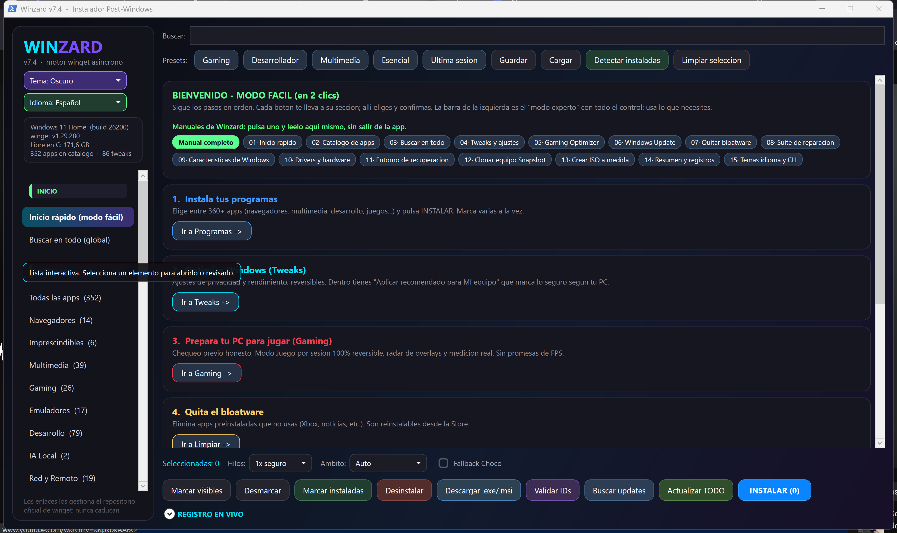
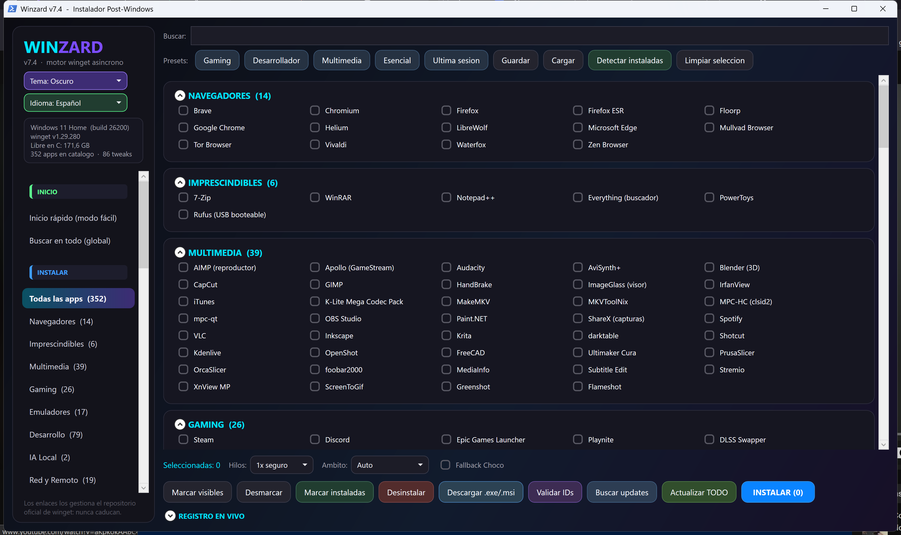
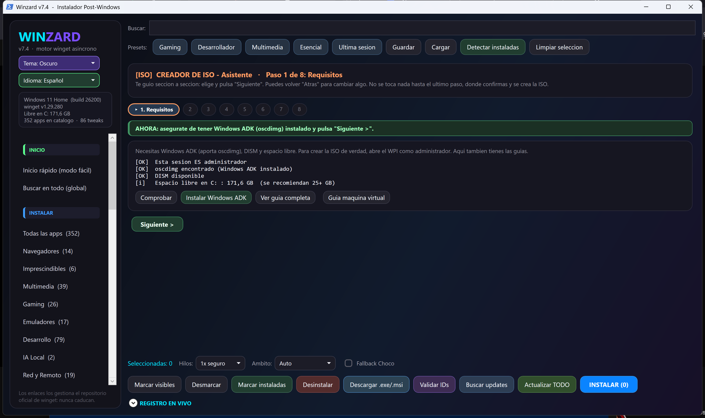
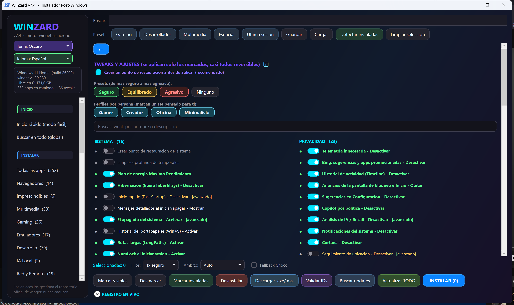
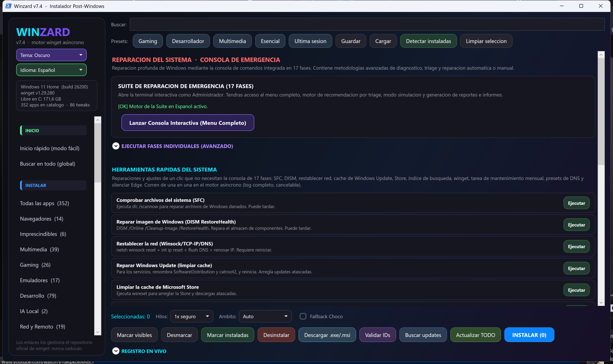
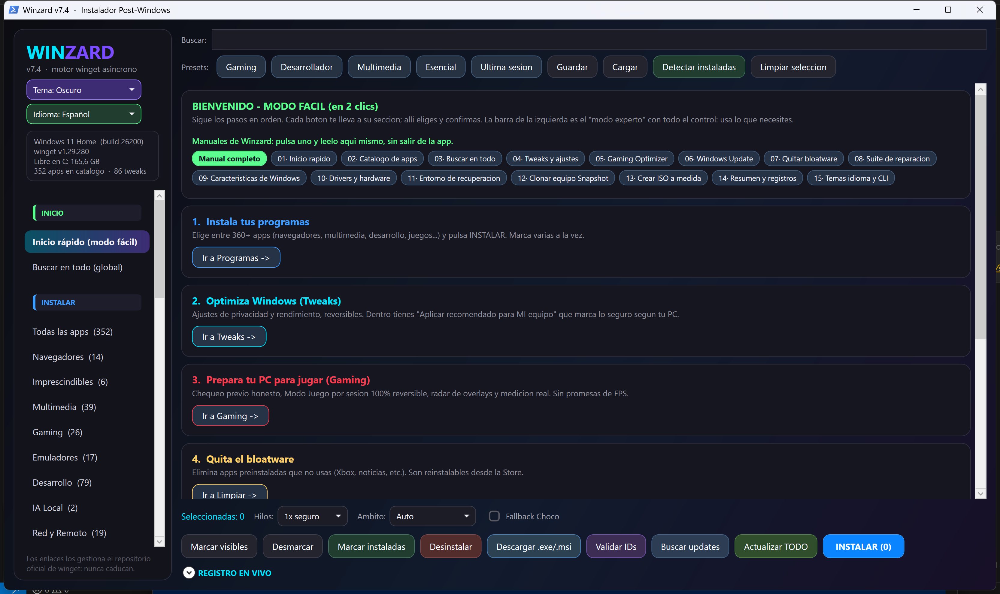
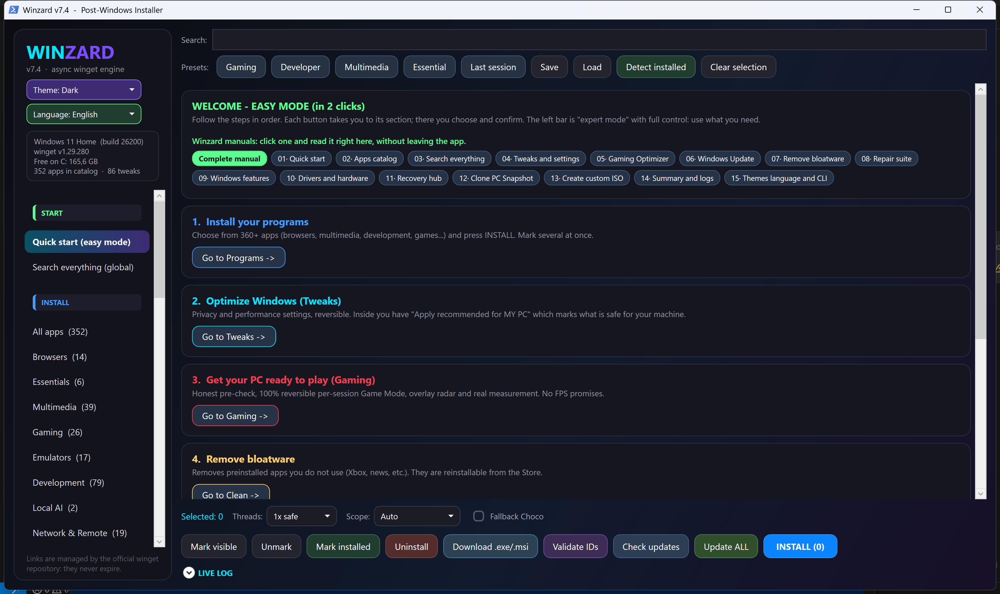

<div align="center">

# 🧙 Winzard

### The all-in-one command center for Windows 10/11 post-install, maintenance and customization

**Install apps with winget · Optimize & clean Windows · Repair the system in phases · Build your own custom ISO**

[](#requirements)
[](#requirements)
[](#-installing-programs-with-winget)
[](LICENSE)
[](#-two-languages-and-three-themes)
[](CONTRIBUTING.md)

**🌐 Languages:** [Español](README_ES.md) · **English (you are here)**

</div>

<p align="center">
  
</p>

<p align="center">
  <b>🛒 360+ apps</b> &nbsp;·&nbsp; <b>⚙️ 40+ tweaks</b> &nbsp;·&nbsp; <b>🧹 Debloat</b> &nbsp;·&nbsp; <b>🩹 17-phase repair</b> &nbsp;·&nbsp; <b>💿 Custom ISO</b> &nbsp;·&nbsp; <b>🌍 ES / EN</b>
</p>

---

> **TL;DR** — Winzard is a single GUI app that lets you **build your ideal Windows** in minutes: install hundreds of legal programs with winget, apply privacy and performance tweaks, remove bloatware, repair the system with a professional 17-phase suite and — the real killer feature — **craft a custom Windows ISO** with your apps, your tweaks and your local account already baked in. All in Spanish or English, with three visual themes.

---

## 📑 Table of contents

- [What is Winzard?](#-what-is-wpi-moderno)
- [Why use it?](#-why-use-it)
- [Requirements](#requirements)
- [Installation & first run](#-installation--first-run)
- [Interface tour (section by section)](#-interface-tour-section-by-section)
- [Installing programs with winget](#-installing-programs-with-winget)
- [Main buttons explained](#-main-buttons-explained)
- [The custom ISO creator (the crown jewel)](#-the-custom-iso-creator-the-crown-jewel)
- [The Repair Suite (17 phases)](#-the-repair-suite-17-phases)
- [Two languages and three themes](#-two-languages-and-three-themes)
- [Verification & safety](#-verification--safety)
- [Inspiration & credits](#-inspiration--credits)
- [Contributing](#-contributing)
- [License](#-license)

---

## 🎯 What is Winzard?

**WPI** stands for *Windows Post-Installer*: a tool that does everything you'd normally do "by hand" after installing Windows, but in a **fast, organized and reproducible** way.

Picture this: you just reinstalled Windows. Normally you'd have to:

- Hunt down and install your 30 favorite programs one by one.
- Toggle dozens of privacy and performance settings buried in menus.
- Uninstall the bloatware that ships from the factory.
- Hope Windows doesn't break.

Winzard does **all of that from a single window** — and goes much further: it can **repair** a broken Windows and **build a tailor-made installation ISO** so your next reinstall already comes fully set up.

It's built on **PowerShell + WPF** (Windows' native GUI framework). No installation required: it just runs.

---

## 💡 Why use it?

| | |
|---|---|
| 🛒 **360+ programs** | A curated catalog organized into **22 categories**, installable in one click via winget. |
| 🔍 **Smart detection** | It knows what you already have, **which version** you're on and **the latest available**. |
| ⚙️ **40+ tweaks** | Privacy, performance, Explorer, telemetry... explained and, where possible, **reversible**. |
| 🧹 **Transparent debloat** | Removes preinstalled apps and promo components, logging everything. |
| 🛠️ **17-phase repair suite** | Bilingual, standalone, with an *anti false-OK* philosophy. |
| 💿 **Custom ISO creator** | Your ideal Windows as a ready-to-burn `.iso`. |
| 🌍 **Bilingual (ES/EN) + 3 themes** | Spanish or English, with Light, Dark or Blue theme. |
| ✅ **100% legal & transparent** | No piracy: everything comes from **winget** and official sources. Logged actions. |

---

## Requirements

- **Windows 10 or 11** (x64).
- **PowerShell 5.1 or later** (ships with Windows).
- **winget / App Installer** (included in modern Windows; if missing, WPI warns you).
- **Administrator rights** for system operations (Windows will request UAC elevation).
- *(Optional)* **Windows ADK / oscdimg** only if you're going to **create a custom ISO**.

---

## 🚀 Installation & first run

Winzard is *portable*: **no install**, just run it.

```text
1. Download the latest release ZIP.
2. Extract it to a local folder — e.g.  C:\WPI
3. Run  Iniciar_WPI.bat
4. Accept the UAC elevation prompt when Windows asks.
5. Pick your language and theme, and start with whatever section you need.
```

> 💡 **Tip:** extract to a path **without accents or odd spaces** (`C:\WPI` is ideal). The ISO creator works best that way.

The `Iniciar_WPI.bat` launcher sets up UTF-8 encoding, requests administrator rights and opens the GUI.

> ℹ️ **Note:** the app is launched via `Iniciar_WPI.bat` and its window shows **WPI Moderno** — that's the internal engine name behind **Winzard**.

---

## 🧭 Interface tour (section by section)

When you open WPI you'll see a **side menu** with every area. Here's what each one does:

### 🏠 Quick start (easy mode)
A welcome screen for people who want to get straight to it: shortcuts to the most common actions without getting lost in advanced options.

### 🔎 Search everything (global)
A cross-app search that filters **everything**: apps, tweaks, sections... Type what you need and jump right to it.

### 📦 All apps
The heart of the catalog: **360+ programs** organized by category. Check the ones you want, hit **INSTALL** and winget does the rest. This is where the **one-click presets** live (Gaming, Developer, Multimedia, Essential, Last session).

### 🌐 Search in winget (all)
Not in the curated catalog? Search **any package** in winget's official repository and mark it for install. The whole winget universe at your fingertips.

### 🧬 Clone PC / Snapshot
Export **everything you have installed** to a file and reinstall it on another PC. Perfect for cloning your environment or migrating to a new machine.

### 🔄 Available updates
Centralizes `winget upgrade`. See **which programs have an update** (current version → available version) and update them from the UI, in bulk or one by one.

### ⚙️ Tweaks and settings
Over **40 settings** for privacy, performance, Explorer, taskbar, telemetry and power. Each tweak shows its state (applied / not applied / recommended / advanced) and, where it makes sense, can be **reverted**. Option to create a **restore point** before applying.

### 🪟 Windows Update
System update management from a clean panel.

### 🧹 Remove bloatware (Appx)
Removes preinstalled apps (Xbox, Copilot, promo apps...) for both the current user and the system image. Detects what's still installed and color-codes the state.

### 🩹 Repair
Access to quick fixes, the **classic Windows panels** (Control Panel, Services, Device Manager, gpedit...) and, above all, the **17-phase Repair Suite** ([see below](#-the-repair-suite-17-phases)).

### 🧩 Windows features
Enable or disable optional Windows components (Hyper-V, WSL2, .NET, etc.) with their real state detected live.

### 🖥️ Drivers and hardware
Detects and shows your PC specs (GPU, CPU, RAM, disks, motherboard, BIOS, battery, sensors) and lets you **export/back up drivers** to reinstall them after a clean install.

### 💿 Create Windows ISO (advanced)
The wizard that builds your **custom ISO** ([the crown jewel, explained below](#-the-custom-iso-creator-the-crown-jewel)).

### 📊 System summary
A bird's-eye view: current theme, catalog apps, applied tweaks, bloatware present, disk, RAM, restore point, winget status...

### 📚 Guides
Built-in mini-tutorials (e.g. how to set up emulators) shown in the active language.

### 📋 Log viewer
Everything WPI does is logged. Here you can review the forensic logs of each session.

---

## 🛒 Installing programs with winget

WPI **does not host or distribute software**. It uses **winget** (Microsoft's official package manager) to install each program from its **official source**. That means:

- ✅ **100% legal**: no cracks, no shady repos.
- ✅ **Always up to date**: winget installs the latest version published by the developer.
- ✅ **Safe and auditable**: every action is logged.

### Smart automatic detection

A flagship feature: WPI **looks at your PC and understands what you have**.

```text
┌─ For every catalog app, WPI knows:
│
├─ 🟢 Do you have it installed?     → it auto-checks it
├─ 🔢 Which version do you have?    → the version on your machine
├─ ⬆️  Is there a newer one?         → the latest available on winget
└─ 🔁 Want to update?               → one click and done
```

So you never install something twice, and keeping everything current is trivial.

### Catalog organized by categories

Over **360 programs** classified so you find what you need instantly:

| Category | Examples of what you'll find |
|---|---|
| 💻 **Development** (80) | Editors, IDEs, languages, version control, containers |
| 🔧 **Utilities** (52) | Compressors, managers, everyday tools |
| 🎬 **Multimedia** (39) | Players, video/audio/image editing |
| 🎮 **Gaming** (30) | Launchers, gaming tools |
| 🕹️ **Emulators** (18) | Retro and modern consoles |
| 🌐 **Network & Remote** (21) | VPN, remote access, network tools |
| 💬 **Communication** (19) | Messaging, video calls |
| 🧱 **System** (15) | System tools |
| 📈 **Productivity** (15) | Notes, management, organization |
| 🧭 **Browsers** (14) | The most popular browsers |
| 🎨 **Interface** (12) | Desktop customization |
| 💾 **Disks & Backup** (12) | Partitioning, backups |
| 🔒 **Security** (11) | Anti-malware, encryption |
| 🕵️ **Privacy** (11) | Privacy tools |
| 📄 **Office** (10) | Office suites, PDF |
| ⚡ **Runtimes** (8) | .NET, Visual C++, Java… |
| 🏠 **SelfHosted** (7) | Self-hosting services |
| 📊 **Monitoring** (6) | Temperatures, performance |
| ⭐ **Essentials** (6) | The basics for any PC |
| 🚀 **Performance** (4) | Optimization |
| ☁️ **Cloud & Sync** (4) | Storage and sync |
| 🤖 **Local AI** (2) | AI models on your own machine |

### One-click presets

In a hurry? Hit a preset and WPI checks the whole pack for you:

- 🎮 **Gaming** — the recommended gaming pack.
- 👨‍💻 **Developer** — development tools.
- 🎬 **Multimedia** — video, audio and image editing.
- ⭐ **Essential** — the basics for any PC.
- 🕘 **Last session** — restores your last selection.

---

## 🎛️ Main buttons explained

The apps section has an action bar. Here's what each button does:

| Button | What it does |
|---|---|
| **INSTALL** | Installs all checked apps via winget (you can check several at once). |
| **Update ALL** | Runs `winget upgrade --all`: brings *every* program winget recognizes up to date. |
| **Validate IDs** | Checks that the winget IDs of the selected apps are valid and exist. |
| **Search updates** | Looks for available updates for what you already have. |
| **Uninstall** | Removes the checked apps from the system *(irreversible)*. |
| **Download .exe/.msi** | Downloads the installer directly, bypassing winget. |
| **Mark visible / Unmark** | Selects or clears everything visible in the list. |
| **Detect installed** | Scans your PC and checks what you already own from the catalog. |
| **Save / Load profile** | Saves your selection to a profile to reuse on another machine. |
| **Threads** | Number of parallel installs (faster, more load). |
| **Scope** | Install for all users or just yours. |
| **Choco Fallback** | If winget fails on an app, it tries Chocolatey. |

> 💬 **Tooltips everywhere:** hover over any button, checkbox or control and WPI explains what it does, in your language. Nothing to memorize.

---

## 💿 The custom ISO creator (the crown jewel)

This is the feature that lifts WPI above a simple app installer. **What if your next Windows install already came fully set up?**

The **ISO Creator** starts from an **official Windows ISO** (the one you download from Microsoft) and turns it into **yours**: same legitimate base, but with your software, your settings and your account already integrated. When you install Windows with it, you boot straight into a clean, optimized and **ready-to-use** system.

### The genius of the process

Instead of installing Windows and *then* configuring it (the usual way), WPI **bakes the configuration into the installation image itself**. The work is done **once** and reused forever.

### The 8 wizard steps

The wizard walks you through it. Here's what happens at each step:

```text
┌──────────────────────────────────────────────────────────────┐
│  ISO CREATOR WIZARD  ·  8 steps                              │
├──────────────────────────────────────────────────────────────┤
│                                                                │
│  1️⃣  Requirements                                             │
│      Checks you're an administrator, that oscdimg            │
│      (Windows ADK) is available, that DISM works and          │
│      that there's enough free space on C:.                    │
│                                                                │
│  2️⃣  Source and output                                        │
│      Pick the official source ISO, the output folder, the     │
│      final ISO name and the working folder. You can detect    │
│      the real EDITIONS in the ISO (Home, Pro…) and choose     │
│      to customize one or all of them.                         │
│                                                                │
│  3️⃣  Tweaks (privacy and performance)                         │
│      Choose which settings the ISO ships with pre-applied.    │
│                                                                │
│  4️⃣  Bloatware to remove                                      │
│      Choose which preinstalled apps are removed OFFLINE       │
│      straight from the image (they never even install).       │
│                                                                │
│  5️⃣  Apps to install                                          │
│      Select which catalog programs auto-install on first      │
│      boot.                                                     │
│                                                                │
│  6️⃣  Drivers to inject                                        │
│      Inject your hardware's drivers so Windows boots with      │
│      everything already recognized.                           │
│                                                                │
│  7️⃣  Unattended install                                       │
│      Configure the local account, language and the Windows    │
│      11 bypasses (TPM / Microsoft account) if you need them.  │
│      A tailored autounattend.xml is generated.                │
│                                                                │
│  8️⃣  Summary and confirmation                                 │
│      Review everything and build the KIT. The final ISO is    │
│      reassembled with oscdimg as administrator.               │
│                                                                │
└──────────────────────────────────────────────────────────────┘
```

### What it does under the hood

- 🧹 **Offline debloat** on the mounted image (apps never even exist).
- 🔌 **Driver injection** with DISM.
- 🧰 **WPI integration** and **offline winget** so first boot installs your apps.
- 📝 **Tailored `autounattend.xml`** (local account, language, Windows 11 options).
- 🏗️ **Final image reassembly** with `oscdimg`.

### After building the ISO

WPI includes `Verificar_ISO.ps1` to **confirm your ISO has everything** (WPI folder, autounattend, editions, drivers, winget) before you burn it:

```powershell
powershell -NoProfile -ExecutionPolicy Bypass -File .\Verificar_ISO.ps1 -Iso "C:\path\WPI_Custom_EN.iso" -ExpectedLang EN
```

To write it to a USB, WPI recommends **Rufus** (GPT scheme, UEFI target) and warns you of a key detail: when Rufus shows the "Windows User Experience" window, **do not tick any checkbox**, or it would overwrite WPI's configuration.

> ⚠️ **Legal note:** WPI **does not include any Windows ISO**. You provide Microsoft's official ISO; WPI only customizes it on your machine. The final ISO is **never uploaded** to any repository.

---

## 🛠️ The Repair Suite (17 phases)

When Windows misbehaves — weird errors, stuck Windows Update, corrupt components — the **Repair Suite** is your emergency kit. It's a **standalone, bilingual console** that diagnoses and repairs the system in **17 ordered phases**, with one key philosophy: **no false "OK"s**. If a phase can't fix something, it says so clearly.

It lives in two independent launchers (you can use it even without opening the GUI):

```text
Suite_Reparacion_ES\Suite_Reparacion_TodoEnUno.bat      (Spanish)
Suite_Reparacion_EN\Repair_Suite_AllInOne.bat           (English)
```

### Available modes

| Mode | What it does |
|---|---|
| *(no arguments)* | **Interactive menu**: choose what to do step by step. |
| `/triage` | **Diagnoses** and runs only the recommended phases based on what it finds. |
| `/auto` | Full **unattended run**. |
| `/quick` | **Quick inspection** without deep repair. |
| `/dry` | **Simulation**: shows what it would do, touching nothing. |
| `/phases:05,06,13` (EN) · `/fases:05,06,13` (ES) | Runs **only** the phases you list. |
| `/manual` | **Manual** action selection. |
| `/plan` | Shows a **guided plan** before running. |
| `/selftest` | **Safe self-test** of the suite itself. |
| `/help` · `/version` | Help and version (no admin needed). |

### The 17 phases (00–16)

| Phase | Name | What it does |
|:---:|---|---|
| **00** | Diagnosis & triage | Disk SMART, space, pending reboots, events, network, battery and RAM. |
| **01** | Restore point | Creates a restore point and a registry backup. |
| **02** | Initial cleanup | Temp files, recycle bin and initial caches. |
| **03** | CHKDSK | Online scan of the system disk. |
| **04** | Disk optimization | TRIM/defrag depending on the drive type (SSD/HDD). |
| **05** | DISM | `RestoreHealth` with a local offline source if available. |
| **06** | SFC & verification | Runs SFC and classifies the result without depending on language (anti false-OK). |
| **07** | WMI repair | Verifies and repairs the WMI repository. |
| **08** | Store apps & Start | Re-registers Appx and repairs the Start menu. |
| **09** | Search & caches | Search index, icons, fonts and spooler. |
| **10** | Certificates & time | Syncs time and root certificates. |
| **11** | Network | Winsock, IP, DNS, proxy, ARP, routes and hosts. |
| **12** | GPO policies | `gpupdate /force`. |
| **13** | Windows Update | Services, caches, qmgr, DLLs, WSUS IDs and forced detection. |
| **14** | Winget | Repairs winget sources and operability. |
| **15** | Devices | Detects problematic devices and drivers. |
| **16** | Final cleanup & report | Final cleanup, health check and **HTML report**. |

> 🧠 **Anti false-OK philosophy:** many tools say "repaired" when they actually fixed nothing. The Suite classifies results for real (e.g. reading SFC's CBS logs without depending on the system language) to give you an honest verdict.

---

## 🌍 Two languages and three themes

Winzard is built for everyone:

### 🗣️ Languages
- **Spanish** 🇪🇸
- **English** 🇬🇧

Switch from the header; it applies on app restart. **The entire** interface is translated: menus, descriptions, states, hardware data, dialogs, the ISO creator, the guides and even the engine's **live log**.

### 🎨 Themes
- 🌙 **Dark** (default)
- ☀️ **Light**
- 🔵 **Blue** — a warm nod to **Chris Titus**' style.

---

## ✅ Verification & safety

WPI includes a **comprehensive verifier** that checks PowerShell parsing, suite synchronization, integrity hashes, encoding (no mojibake, no BOM) and translation coverage (no Spanish text leaking into the English version):

```powershell
powershell -NoProfile -ExecutionPolicy Bypass -File .\Verificar_Proyecto.ps1 -ConsoleSmoke
```

### Transparency commitment

- 🚫 **No pirated software.** Everything is installed with winget from official manifests.
- 📜 **Everything is logged.** Relevant actions leave a trail.
- 🔐 **Admin only when needed.** System operations request elevation.
- 🙈 **Nothing private to the repo.** Don't upload ISOs, personal logs or internal reports.

---

## 📸 Screenshots

<table>
  <tr>
    <td width="50%"><br><sub><b>360+ app catalog with winget</b></sub></td>
    <td width="50%"><br><sub><b>Custom ISO creator (8 steps)</b></sub></td>
  </tr>
  <tr>
    <td width="50%"><br><sub><b>Privacy & performance tweaks</b></sub></td>
    <td width="50%"><br><sub><b>17-phase Repair Suite</b></sub></td>
  </tr>
</table>

> 🌍 Winzard is bilingual:  

## 🙏 Inspiration & credits

Winzard was born, **with respect and admiration**, from the ecosystem of professional Windows post-install tools. It especially pays tribute to:

- **[Chris Titus Tech](https://github.com/ChrisTitusTech/winutil)** and his **WinUtil** — the absolute reference of the genre (hence the "Blue" theme as a nod).
- The community of Windows *debloat*, *tweak* and automation scripts that has shared knowledge for years.

On top of that inspiration, Winzard brings its **own vision**: a **bilingual** interface, an **integrated ISO creator**, a **curated** catalog of 360+ apps, portable **profiles** and a **phase-based repair suite** with an anti false-OK philosophy.

---

## 🤝 Contributing

Contributions are welcome! See **[CONTRIBUTING.md](CONTRIBUTING.md)**. Useful ideas:

- New catalog apps (with their winget ID).
- ES/EN translation improvements.
- New tweaks (reversible and well documented).
- Virtual machine testing.
- Documentation improvements.
- Repair Suite fixes.

---

## 📄 License

Released under the **MIT** license. See **[LICENSE](LICENSE)**. You're free to use, modify and share the project.

---

<div align="center">

**If Winzard saves you time, drop it a ⭐ — it helps more people find it.**

Made with ❤️ for the Windows community.

</div>
